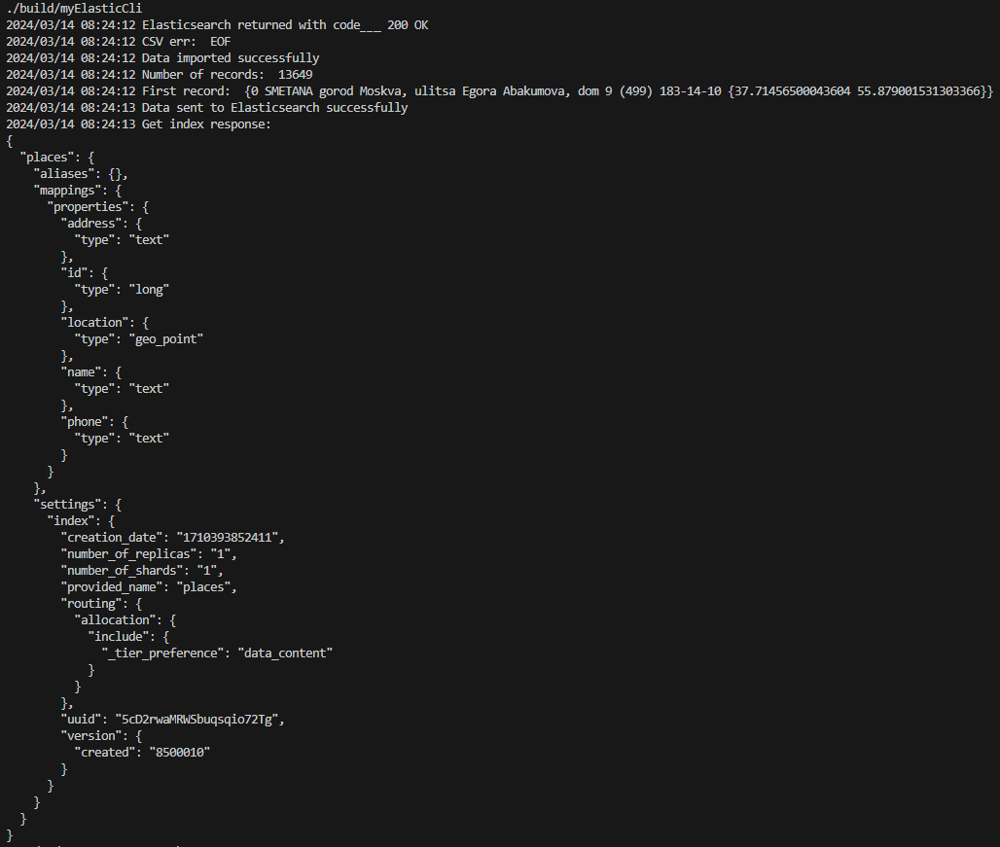
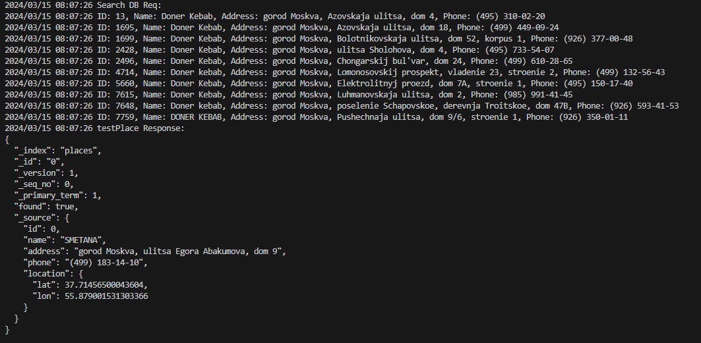

# Day 03 - Go Boot camp

## Tasty Discoveries

## Info
Folder src contains elastic_start.sh for starting server from goingfree folder on Mac and from User folder on linux. Instruction for elastic instalation in materials folder.

## Chapter IV
### Exercise 00: Loading Data

* curl -s -XGET "http://localhost:9200/places"

*curl -s -XGET "http://localhost:9200/places/_doc/0"

## Chapter V
### Exercise 01: Simplest Interface

